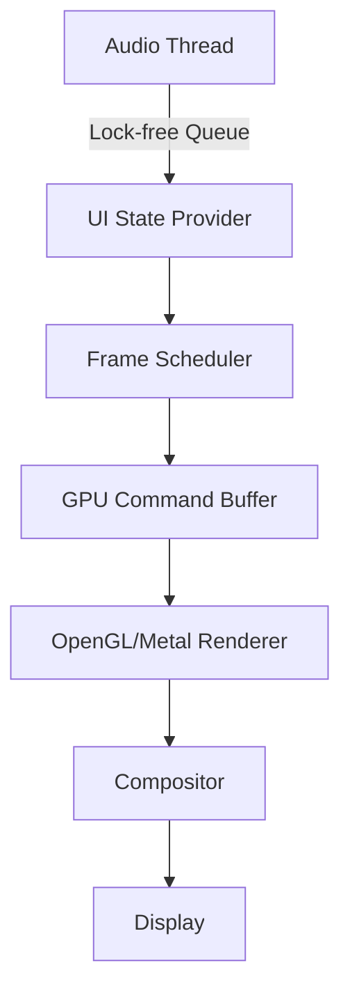

# FieldEngineFX: Xenomorphic Audio Interface Design

## Executive Summary

FieldEngineFX transforms the traditional audio plugin paradigm into an alien audio processing artifact. The interface feels like operating recovered extraterrestrial technology, where EMU Z-plane filters become living constellations and parameter control surfaces respond like biomechanical organisms.

## Visual Design Philosophy

### Core Aesthetic: "Derelict Spacecraft Audio Lab"

The interface embodies three visual principles:

1. **Organic Technology**: Controls feel alive, breathing and pulsating with energy
2. **Gravitational UI**: Elements attract and repel based on audio energy
3. **Holographic Depth**: Layered transparency creates dimensional interfaces

### Color Palette

```css
Primary:   #00FFB7 (Bioluminescent Cyan)
Secondary: #FF006E (Energy Magenta)  
Void:      #0A0E1B (Deep Space Black)
Nebula:    #6B5B95 (Cosmic Purple)
Crystal:   #E8F4FF (Translucent White)
Warning:   #FFB700 (Solar Amber)
```

## Component Architecture

### 1. Z-Plane Galaxy (Main Visualization)

**Concept**: Filter coefficients rendered as pulsating star constellations within a gravitational field.

**Technical Implementation**:
- GPU-accelerated particle system (2048 particles)
- Real-time gravitational physics simulation
- OpenGL 3.2+ with custom GLSL shaders
- Lock-free state updates from audio thread

**Key Features**:
- Poles/zeros visualized as energy nodes
- Morph paths shown as gravitational waves
- Quantum fluctuation effects
- HDR bloom rendering

**Performance Target**: <1.2ms render time @ 60fps

### 2. Biomechanical Knobs

**Concept**: Organic control surfaces that breathe and morph based on parameter values.

**Visual Behavior**:
- Hexagonal crystalline structure
- Breathing animation (sine wave, 0.2Hz)
- Pressure-sensitive morphing
- Energy field visualization on hover

**Interaction Design**:
- Rotary control with momentum
- Pressure sensitivity for fine control
- Haptic feedback simulation via visual response
- Context-sensitive value snapping

### 3. Preset Nebula Browser

**Concept**: 3D spherical preset browser where presets cluster by sonic similarity.

**Technical Features**:
- K-means clustering algorithm
- Gravitational attraction between similar presets
- Proximity-based audio preview
- GPU-accelerated 3D rendering

**User Experience**:
- Navigate through preset "space"
- Presets glow brighter when approached
- Automatic morphing between nearby presets
- Visual indication of preset characteristics

### 4. Energy Flow Visualizer

**Concept**: Real-time audio visualization as particle streams flowing through the interface.

**Implementation**:
- FFT-based frequency analysis
- Particle color based on spectral content
- Flow direction indicates filter routing
- Energy accumulation at control points

### 5. Modulation Matrix

**Concept**: Gravitational routing system where modulation sources attract destinations.

**Visual Design**:
- Sources as energy emitters
- Destinations as gravitational wells
- Connection strength shown as field intensity
- Animated energy flow along routes

## Interaction Paradigms

### 1. Touch-to-Reveal
Parameters show modulation sources when touched, creating expanding connection visualizations.

### 2. Proximity Preview
Moving near presets triggers gradual audio morphing, allowing exploration without commitment.

### 3. Gravitational Grouping
Related parameters physically attract, creating intuitive control clusters.

### 4. Energy-Based Feedback
Control response scales with audio energy, creating dynamic interaction sensitivity.

## Technical Architecture

### Rendering Pipeline



### Performance Optimization

1. **Level-of-Detail System**
   - Reduce particle count at distance
   - Simplify shaders for static elements
   - Temporal upsampling for effects

2. **Asynchronous Updates**
   - Decouple audio processing from rendering
   - Predictive animation for smooth response
   - Background preset analysis

3. **GPU Utilization**
   - Compute shaders for particle physics
   - Instanced rendering for repeated elements
   - Texture atlasing for UI elements

## Implementation Roadmap

### Week 1: Core Infrastructure
- [ ] GPU rendering framework
- [ ] Lock-free state management
- [ ] Basic shader compilation

### Week 2: Primary Components
- [ ] Z-Plane Galaxy implementation
- [ ] Biomechanical knob system
- [ ] Basic interaction handling

### Week 3: Advanced Features
- [ ] Preset Nebula browser
- [ ] Modulation matrix
- [ ] Energy flow system

### Week 4: Polish & Optimization
- [ ] Performance profiling
- [ ] Visual effect refinement
- [ ] User testing feedback

## Shader Examples

### Gravitational Wave Distortion (GLSL)

```glsl
vec3 gravitationalDistortion(vec3 pos, float time) {
    float wave = sin(length(pos.xy) * PI - time * 2.0) * 0.1;
    float spiral = atan(pos.y, pos.x) + time * 0.5;
    vec2 distortion = vec2(cos(spiral), sin(spiral)) * wave;
    return vec3(pos.xy + distortion, pos.z);
}
```

### Bioluminescent Glow

```glsl
float hexagonGlow(vec2 uv, float energy) {
    float hexDist = hexagon(uv - 0.5, 0.1);
    float glow = exp(-hexDist * hexDist * 10.0) * energy;
    float pulse = sin(time * 3.0 + energy * TAU) * 0.5 + 0.5;
    return glow * pulse;
}
```

## Accessibility Considerations

1. **High Contrast Mode**: Alternate color scheme for visibility
2. **Reduced Motion**: Static visualization option
3. **Keyboard Navigation**: Full parameter control via keys
4. **Screen Reader**: Descriptive parameter announcements

## Future Enhancements

1. **Neural Preset Generation**: AI-created presets based on user behavior
2. **Collaborative Space**: Multi-user preset sharing in 3D space
3. **Biometric Integration**: Heart rate/breathing affects parameters
4. **AR Mode**: Project interface into physical space

## Conclusion

FieldEngineFX's xenomorphic interface transforms audio processing into an otherworldly experience. By treating DSP parameters as living entities within an alien ecosystem, we create an interface that is both functionally superior and emotionally engaging. The GPU-accelerated visuals ensure smooth performance while the biomechanical interactions provide intuitive control over complex EMU filter algorithms.
